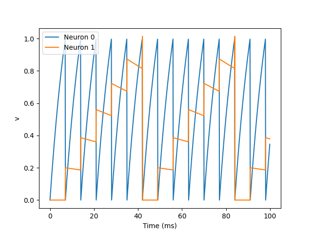
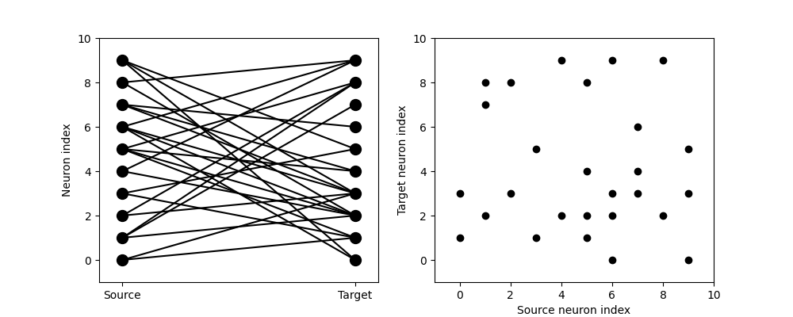
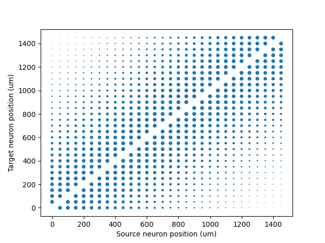
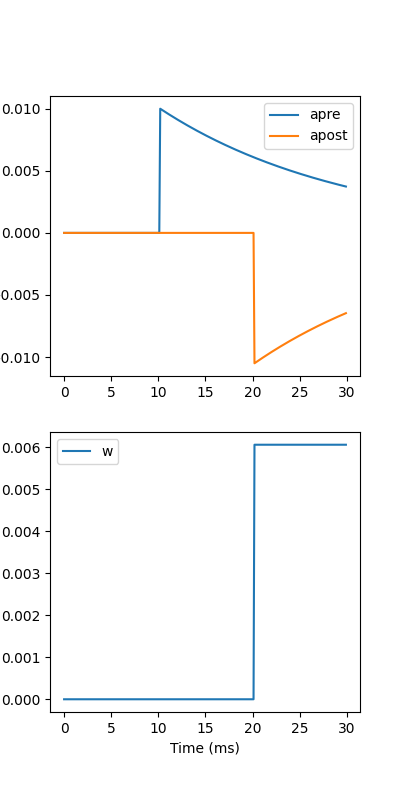

# Spiking Neural Network


### STDP

（spike-timing-dependent plasticity）

STDP是生物大脑/神经学习方式的一种，它依赖于神经前后突触激活时间关系（$\Delta t$）来对连接处的权重进行增强（LTP）/抑制（LTD）。[Bi and Poo, 1998]


- LTP（long-term potentiation）

**前**突触**激活后**的20ms窗口期内**后突触**激活会导致“长时程增强”。

- LTD（long-term depression）

**后**突触**激活前**的20 ms窗口期内**前突触**激活会导致“长时程抑制”。

### 模型定义

（各种STDP模型都是对生物的STDP过程的**模拟/仿真**，各有优劣，这里只写一种）

- 权重的改变过程$\Delta w$

$$
\Delta w = \sum_{t_{pre}} \sum_{t_{post}} W(t_{post}-t_{pre})
$$

- 用于描述LTP和LTD的函数$W(*)$

$$
\begin{split}W(\Delta t) = \begin{cases}
A_{pre} e^{-\Delta t/\tau_{pre}} & \Delta t>0 \\
A_{post} e^{\Delta t/\tau_{post}} & \Delta t<0
\end{cases}\end{split}
$$


#### 改用微分方程

$$
\begin{split}\begin{aligned}
\tau_{pre}\frac{\mathrm{d}}{\mathrm{d}t} a_{pre} &= -a_{pre}\\
\tau_{post}\frac{\mathrm{d}}{\mathrm{d}t} a_{post} &= -a_{post}
\end{aligned}\end{split}
$$

- 前突触脉冲产生时（pre-synaptic spike）

$$
\begin{split}\begin{aligned}
a_{pre} &\rightarrow a_{pre}+A_{pre}\\
w &\rightarrow w+a_{post}
\end{aligned}\end{split}
$$

- 前突触脉冲产生时（post-synaptic spike）

$$
\begin{split}\begin{aligned}
a_{post} &\rightarrow a_{post}+A_{post}\\
w &\rightarrow w+a_{pre}
\end{aligned}\end{split}
$$

Tips：$a_{pre}$/$a_{post}$用于**动态累加**前/后突触激活

## 仿真代码及其结果

使用Brian2进行仿真

### Neuron 0放电导致Neuron 1激活

```python
start_scope()
eqs = '''
dv/dt = (I-v)/tau : 1
I : 1
tau : second
'''
G = NeuronGroup(2, eqs, threshold='v>1', reset='v = 0', method='exact')
G.I = [2, 0]
G.tau = [10, 100]*ms
# Comment these two lines out to see what happens without Synapses
S = Synapses(G, G, on_pre='v_post += 0.2')
S.connect(i=0, j=1)
M = StateMonitor(G, 'v', record=True)
run(100*ms)
```



### 自定义连接方式（有向图）

```python
start_scope()
N = 10
G = NeuronGroup(N, 'v:1')
S = Synapses(G, G)
S.connect(condition='i!=j', p=0.2)
visualise_connectivity(S)
```



### 全连接图（按距离初始化权重）

```python
start_scope()
N = 30
neuron_spacing = 50*umetre
width = N/4.0*neuron_spacing
# Neuron has one variable x, its position
G = NeuronGroup(N, 'x : metre')
G.x = 'i*neuron_spacing'
# All synapses are connected (excluding self-connections)
S = Synapses(G, G, 'w : 1')
S.connect(condition='i!=j')
# Weight varies with distance
S.w = 'exp(-(x_pre-x_post)**2/(2*width**2))'
```



### $W(\Delta T)$ in STDP

```python
tau_pre = tau_post = 20*ms
A_pre = 0.01
A_post = -A_pre*1.05
delta_t = linspace(-50, 50, 100)*ms
W = where(delta_t>0, A_pre*exp(-delta_t/tau_pre), A_post*exp(delta_t/tau_post))
```


### $Apre$ 和 $Apost$ 对 $w$ 的影响

```python
start_scope()
taupre = taupost = 20*ms
wmax = 0.01
Apre = 0.01
Apost = -Apre*taupre/taupost*1.05
G = NeuronGroup(2, 'v:1', threshold='t>(1+i)*10*ms', refractory=100*ms)
S = Synapses(G, G,
             '''
             w : 1
             dapre/dt = -apre/taupre : 1 (clock-driven)
             dapost/dt = -apost/taupost : 1 (clock-driven)
             ''',
             on_pre='''
             v_post += w
             apre += Apre
             w = clip(w+apost, 0, wmax)
             ''',
             on_post='''
             apost += Apost
             w = clip(w+apre, 0, wmax)
             ''', method='linear')
S.connect(i=0, j=1)
M = StateMonitor(S, ['w', 'apre', 'apost'], record=True)
run(30*ms)
```



## 总结

​		本节简述了存在于生物神经网络的一种学习过程“STDP”，通过微分方程描述了一种STDP的计算过程，由于在查阅资料过程中发现还有很多种STDP的实现过程，其中细节有所差别，但其核心依旧围绕**LTP**和**LTD**这两种发生在生物神经中的**现象**进行建模。本节在描述STDP时，没有涉及生物神经膜电位与及其离子通道等过程。（可参考[1]）

​		下一节将研究如何基于SNN实现MLP、CNN等常用算子，并尝试构建简单的网络模型。

代码已经上传到（https://github.com/StephenTaylor1998/SNN-Research）


Reference:

[1] Bi, G.-Q., and Poo, M.-M. (1998). Synaptic modifications in cultured hippocampal
neurons: dependence on spike timing, synaptic strength, and postsynaptic cell
type. J. Neurosci. 18, 10464–10472.


