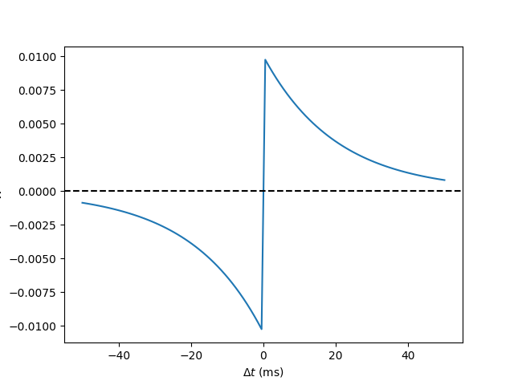

# Spiking Neural Network


## 仿真代码及其结果

使用Brian2进行仿真

### Neuron 0放电导致Neuron 1激活

```python
start_scope()
eqs = '''
dv/dt = (I-v)/tau : 1
I : 1
tau : second
'''
G = NeuronGroup(2, eqs, threshold='v>1', reset='v = 0', method='exact')
G.I = [2, 0]
G.tau = [10, 100]*ms
# Comment these two lines out to see what happens without Synapses
S = Synapses(G, G, on_pre='v_post += 0.2')
S.connect(i=0, j=1)
M = StateMonitor(G, 'v', record=True)
run(100*ms)
```


### 自定义连接方式（有向图）

```python
start_scope()
N = 10
G = NeuronGroup(N, 'v:1')
S = Synapses(G, G)
S.connect(condition='i!=j', p=0.2)
visualise_connectivity(S)
```


### 全连接图（按距离初始化权重）

```python
start_scope()
N = 30
neuron_spacing = 50*umetre
width = N/4.0*neuron_spacing
# Neuron has one variable x, its position
G = NeuronGroup(N, 'x : metre')
G.x = 'i*neuron_spacing'
# All synapses are connected (excluding self-connections)
S = Synapses(G, G, 'w : 1')
S.connect(condition='i!=j')
# Weight varies with distance
S.w = 'exp(-(x_pre-x_post)**2/(2*width**2))'
```


### $W(\Delta T)$ in STDP

```python
tau_pre = tau_post = 20*ms
A_pre = 0.01
A_post = -A_pre*1.05
delta_t = linspace(-50, 50, 100)*ms
W = where(delta_t>0, A_pre*exp(-delta_t/tau_pre), A_post*exp(delta_t/tau_post))
```



### $Apre$ 和 $Apost$ 对 $w$ 的影响

```python
start_scope()
taupre = taupost = 20*ms
wmax = 0.01
Apre = 0.01
Apost = -Apre*taupre/taupost*1.05
G = NeuronGroup(2, 'v:1', threshold='t>(1+i)*10*ms', refractory=100*ms)
S = Synapses(G, G,
             '''
             w : 1
             dapre/dt = -apre/taupre : 1 (clock-driven)
             dapost/dt = -apost/taupost : 1 (clock-driven)
             ''',
             on_pre='''
             v_post += w
             apre += Apre
             w = clip(w+apost, 0, wmax)
             ''',
             on_post='''
             apost += Apost
             w = clip(w+apre, 0, wmax)
             ''', method='linear')
S.connect(i=0, j=1)
M = StateMonitor(S, ['w', 'apre', 'apost'], record=True)
run(30*ms)
```


